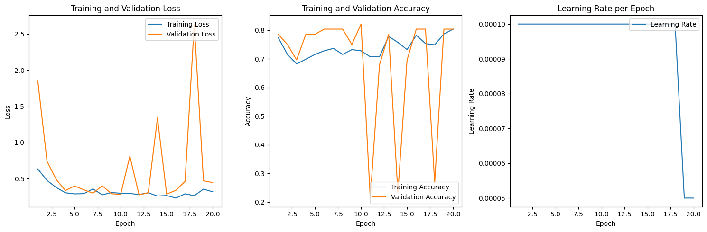
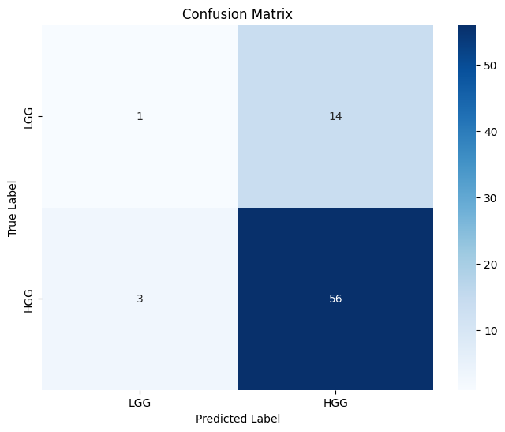

# Brain Tumor Classification (LGG vs. HGG)

This project implements a 3D Convolutional Neural Network (CNN) using MONAI and PyTorch to classify brain tumors as either Low-Grade Glioma (LGG) or High-Grade Glioma (HGG) from multi-modal 3D MRI scans, typically from datasets such as the BraTS (Brain Tumor Segmentation) Challenge.

## Features

*   **Multi-Modal Input:** Utilizes four MRI modalities: FLAIR, T1-weighted (T1), T1-weighted contrast-enhanced (T1CE), and T2-weighted (T2).
*   **3D CNN Architecture:** Employs a ResNet50-based architecture adapted for 3D volumetric data.
*   **Preprocessing Pipeline:** Includes scripts to:
    *   Load NIfTI files.
    *   Perform stratified data splitting (train, validation, test sets).
    *   Apply MONAI transforms for data augmentation and normalization (e.g., resizing, intensity scaling, cropping).
    *   Save processed data as PyTorch tensors (`.pt` files) for faster loading during training.
*   **Training and Evaluation:** Scripts for model training, validation, and performance evaluation on a test set.
*   **Configuration Management:** Centralized configuration for paths, hyperparameters, and model settings.

## Project Structure

```
brain_tumor_detection/
├── data/
│   ├── raw/                     # Directory for raw data
│   │   ├── name_mapping.csv     # CSV mapping Subject IDs to grades (HGG/LGG)
│   │   └── Training/            # Contains individual subject folders (e.g., BraTS20_Training_XXX)
│   │       └── BraTS20_Training_001/
│   │           ├── BraTS20_Training_001_flair.nii.gz
│   │           ├── BraTS20_Training_001_t1.nii.gz
│   │           ├── BraTS20_Training_001_t1ce.nii.gz
│   │           └── BraTS20_Training_001_t2.nii.gz
│   │       └── ...
│   └── processed_data/          # Preprocessed data (PyTorch tensors)
│       ├── train/
│       ├── val/
│       └── test/
├── logs/                        # Log files for preprocessing, training, and evaluation
├── models/                      # Saved model checkpoints
│   └── classification/
│       └── resnet50_classifier_best.pth
│       └── resnet50_classifier_final.pth
├── src/
│   ├── __init__.py
│   ├── config.py                # Configuration (paths, hyperparameters, etc.)
│   ├── dataset.py               # PyTorch/MONAI Dataset definitions
│   ├── evaluate.py              # Script for evaluating the trained model
│   ├── model.py                 # Model definition (ResNet50Classifier)
│   ├── preprocess.py            # Script for data preprocessing and 3-way split
│   ├── transforms.py            # MONAI image transforms
│   ├── train.py                 # Main training script
│   └── utils.py                 # Utility functions (data loading, path handling)
├── requirements.txt             # Python dependencies
└── README.md                    # This file
```

## Setup

1.  **Clone the Repository:**
    ```bash
    git clone <your-repository-url>
    cd brain_tumor_detection
    ```

2.  **Create and Activate a Virtual Environment:**
    It is highly recommended to use a virtual environment. This project uses Python 3.
    ```bash
    python3 -m venv venv
    source venv/bin/activate  # On macOS/Linux
    # venv\Scripts\activate    # On Windows
    ```

3.  **Install Dependencies:**
    ```bash
    pip install -r requirements.txt
    ```

4.  **Prepare Raw Data:**
    *   **`name_mapping.csv`**:
        *   Place your `name_mapping.csv` file inside the `data/raw/` directory.
        *   This CSV file must map subject IDs to their corresponding tumor grade.
        *   It should contain at least two columns:
            *   One for the subject ID (e.g., `BraTS_2020_subject_ID`). The name of this column should match `config.SUBJECT_ID_COL`.
            *   One for the tumor grade (e.g., `Grade` with string values `LGG` or `HGG`). The name of this column should match `config.GRADE_COL`.
    *   **NIfTI Files**:
        *   **Dataset Source:** This project is designed for use with datasets like the BraTS (Brain Tumor Segmentation) Challenge. The data for BraTS 2020, for example, can be requested via the official data hosts, often requiring registration. For information on BraTS 2020 data access, see: [BraTS 2020 Data - University of Pennsylvania](https://www.med.upenn.edu/cbica/brats2020/data.html). Datasets from various BraTS years (e.g., '19, '20, '21) may also be available through other platforms like Kaggle, often uploaded by participants or researchers. Ensure the data you acquire has the required modalities (FLAIR, T1, T1ce, T2) and corresponding `name_mapping.csv` or equivalent information.
        *   All raw MRI scan data (NIfTI format, e.g., `.nii` or `.nii.gz`) should be organized under a common parent directory specified by `config.RAW_DATA_DIR` (which defaults to `data/raw/`).
        *   The `src/utils.py` script (specifically `add_image_paths`) is designed to search for subject folders (e.g., `BraTS20_Training_XXX`) within `config.RAW_DATA_DIR` and also within common subdirectories like `Training/`, `Validation/`, etc., under `config.RAW_DATA_DIR`.
        *   For simplicity, place your subject folders (e.g., `BraTS20_Training_001`, `BraTS20_Training_002`) directly inside `data/raw/Training/`.
        *   Inside each subject's folder, the NIfTI files should be named following the pattern: `{SubjectID}_{modality}.nii.gz` (or `.nii`). For example: `BraTS20_Training_001_flair.nii.gz`.
        *   The modalities used are defined in `config.MODALITIES` (default: `['flair', 't1', 't1ce', 't2']`).

5.  **Download Pretrained Model Weights (Important for `PRETRAINED_RESNET50 = True`)**

    If you intend to use the pretrained ResNet50 model as a starting point for training (as configured by default with `PRETRAINED_RESNET50 = True` in `src/config.py`), you need to download the appropriate MedicalNet ResNet50 weights.

    *   **Source:** These weights can typically be found in the MONAI Model Zoo or official MONAI repositories. Search for "MedicalNet ResNet50" weights compatible with MONAI.
    *   **File:** Download the `.pth` file for the ResNet50 model.
    *   **Placement:** Place the downloaded weights file at `models/pretrained_resnet50_medicalnet.pth`. The `models/` directory should be at the root of the project. If this path is different, update `PRETRAINED_WEIGHTS_PATH` in `src/config.py`.
    *   **Expected Weights:** The current codebase (`src/model.py`) expects the pretrained ResNet50 to have been trained with:
        *   **Input Channels:** 3 (as per `n_input_channels=3` when `resnet50` is called for pretraining in `get_base_resnet50_model`).
        *   **Number of Classes:** 10 (as per `NUM_CLASSES_PRETRAINED = 10` in `src/config.py`).
        Ensure the weights you download match these characteristics, or adjust the parameters in `src/model.py` and `src/config.py` accordingly. The `ResNet50Classifier` will adapt this base model for the specific number of input modalities (4) and output classes (1) of this project.

## Workflow

The typical workflow involves preprocessing the raw data, training the model, and then evaluating its performance.

### 1. Preprocessing Raw Data

This step loads the raw NIfTI files, performs a 3-way stratified split (train/validation/test), applies specified MONAI transforms (resizing, normalization, etc.), and saves the processed data as PyTorch tensor files (`.pt`) for efficient loading during training and evaluation.

*   **Command:**
    ```bash
    python3 -m src.preprocess
    ```
*   **Output:**
    *   Processed tensor files will be saved in `data/processed_data/train/`, `data/processed_data/val/`, and `data/processed_data/test/`.
    *   Logs will be saved to `logs/preprocessing.log`.
*   **Configuration:**
    *   Review and adjust settings in `src/config.py`, particularly `RESIZED_SHAPE`, `INTENSITY_SCALE_MIN_A`, `INTENSITY_SCALE_MAX_A`, etc., before running.

### 2. Training the Model

Once the data is preprocessed, you can train the classification model.

*   **Command (using preprocessed data):**
    ```bash
    python3 -m src.train --load_preprocessed --epochs <num_epochs>
    ```
    *   `--load_preprocessed`: Tells the script to load data from `data/processed_data/`.
    *   `--epochs <num_epochs>`: Specify the number of training epochs (e.g., `--epochs 50`). Defaults to `config.NUM_EPOCHS`.
    *   Other arguments like `--batch_size`, `--lr` (learning rate), `--device` (`cuda` or `cpu`) can also be specified. See `src/train.py` for all options or run `python3 -m src.train --help`.
*   **Alternative (training directly from raw NIfTI files - slower I/O):**
    ```bash
    python3 -m src.train --epochs <num_epochs>
    ```
    This method applies transforms on-the-fly and is generally slower for repeated runs compared to using preprocessed data. It will also perform its own internal 70/15/15 data split using `name_mapping.csv` and save a `test_set.csv`.
*   **Output:**
    *   Model checkpoints (e.g., `resnet50_classifier_best.pth`, `resnet50_classifier_final.pth`) will be saved to `models/classification/`.
    *   Logs will be saved to `logs/training.log`.
*   **Note on Resources:** For meaningful results and faster training, a GPU (`--device cuda`) is highly recommended. Training on a CPU will be very slow.

### 3. Evaluating the Model

After training, evaluate the model's performance on the test set.

*   **Command (using preprocessed test data):**
    ```bash
    python3 -m src.evaluate --load_preprocessed
    ```
    *   `--load_preprocessed`: Loads test data from `data/processed_data/test/`.
    *   By default, this will load the `_best.pth` model from `models/classification/`.
    *   To specify a different model: `python3 -m src.evaluate --load_preprocessed --model_path path/to/your/model.pth`
*   **Alternative (evaluating from raw NIfTI files):**
    If you trained without `--load_preprocessed`, `train.py` would have created a `data/test_set.csv`. You can evaluate using this and raw files:
    ```bash
    python3 -m src.evaluate
    ```
*   **Using Validation Set for Quick Evaluation (Local Testing):**
    If you only preprocessed train/val sets (e.g., during initial local tests if `src/preprocess.py` was modified to only create train/val):
    ```bash
    python3 -m src.evaluate --load_preprocessed --use_val_for_eval
    ```
*   **Output:**
    *   Classification report and confusion matrix will be printed to the console.
    *   Logs, including these metrics, will be saved to `logs/evaluation.log`.

## Model Performance

The model was trained on Kaggle. The following plots showcase its performance.

### Training History

This plot shows the training and validation loss and accuracy over epochs, as well as the learning rate schedule.



**Summary of Training:**
*   The model was trained for 20 epochs.
*   Final Training Loss: ~0.3
*   Final Validation Loss: ~0.5 (with notable spikes during training, e.g., up to ~2.5 around epoch 18)
*   Final Training Accuracy: ~73%
*   Final Validation Accuracy: ~80% (though with significant fluctuations and dips during training)
*   Learning Rate: Started at 1e-4, reduced to 5e-5 at epoch 20.
*   The validation metrics showed some instability, suggesting periods of potential overfitting or difficulty in generalization.

### Evaluation

The model's performance on the test set is summarized by the following confusion matrix:



**Summary of Evaluation:**
*   Total Test Samples: 74
*   Overall Accuracy: Approximately 77.0% (57 out of 74 correct).
*   **Performance on HGG (High-Grade Glioma):**
    *   Correctly Classified (True Positives): 56
    *   Misclassified as LGG (False Negatives): 3
    *   High recall for HGG.
*   **Performance on LGG (Low-Grade Glioma):**
    *   Correctly Classified (True Negatives): 1
    *   Misclassified as HGG (False Positives): 14
    *   Very low recall for LGG.
*   **Key Observation:** The model demonstrates a strong bias towards predicting HGG. While it successfully identifies most HGG cases, it frequently misclassifies LGG cases as HGG.

## Configuration

Key parameters can be adjusted in `src/config.py`:
*   **Paths:** `RAW_DATA_DIR`, `PREPROCESSED_DIR`, `MODEL_DIR`, `LOG_DIR`.
*   **Data Settings:** `MODALITIES`, `SUBJECT_ID_COL`, `GRADE_COL`, `LABEL_MAPPING`.
*   **Preprocessing:** `RESIZED_SHAPE` (default `(128, 128, 128)` for computational efficiency; original data dimensions might be larger, e.g., 240x240x155, which are cropped/resized), intensity scaling parameters.
*   **Training Hyperparameters:** `DEVICE`, `NUM_EPOCHS`, `BATCH_SIZE`, `LEARNING_RATE`.
*   **Model Settings:** `MODEL_NAME`, `NUM_INPUT_CHANNELS`, `SPATIAL_DIMS`.

## Important Notes

*   **Python Version:** This project is developed with Python 3.9. Ensure your environment uses a compatible Python 3 version.
*   **Computational Resources:** Training 3D CNNs on medical images is computationally intensive. For full-scale training, access to a GPU with sufficient VRAM is essential. The default settings in `config.py` (e.g., `BATCH_SIZE`, `RESIZED_SHAPE`) are conservative for local CPU execution but should be increased for GPU training.
*   **Dataset Size:** The example commands are suitable for testing the pipeline with a small local dataset. Real-world performance requires a large and diverse dataset.
*   **MONAI Documentation:** For more details on the transforms and network components used, refer to the [MONAI Project documentation](https://monai.io/).

## References and Citations

If you use the BraTS dataset in your research, please ensure to cite the following publications as per the BraTS data usage agreement:

1.  Menze, B. H., Jakab, A., Bauer, S., Kalpathy-Cramer, J., Farahani, K., Kirby, J., et al. (2015). The Multimodal Brain Tumor Image Segmentation Benchmark (BRATS). *IEEE Transactions on Medical Imaging, 34*(10), 1993-2024. DOI: [10.1109/TMI.2014.2377694](https://doi.org/10.1109/TMI.2014.2377694)

2.  Bakas, S., Akbari, H., Sotiras, A., Bilello, M., Rozycki, M., Kirby, J. S., et al. (2017). Advancing The Cancer Genome Atlas glioma MRI collections with expert segmentation labels and radiomic features. *Nature Scientific Data, 4*, 170117. DOI: [10.1038/sdata.2017.117](https://doi.org/10.1038/sdata.2017.117)

3.  Bakas, S., Reyes, M., Jakab, A., Bauer, S., Rempfler, M., Crimi, A., et al. (2018). Identifying the Best Machine Learning Algorithms for Brain Tumor Segmentation, Progression Assessment, and Overall Survival Prediction in the BRATS Challenge. *arXiv preprint arXiv:1811.02629*. Link: [https://arxiv.org/abs/1811.02629](https://arxiv.org/abs/1811.02629)

Additionally, if no restrictions are imposed by the journal/conference, the BraTS organizers request citing the specific TCIA data sources:

4.  Bakas, S., Akbari, H., Sotiras, A., Bilello, M., Rozycki, J., Kirby, J. S., et al. (2017). Segmentation Labels and Radiomic Features for the Pre-operative Scans of the TCGA-GBM collection. *The Cancer Imaging Archive*. DOI: [10.7937/K9/TCIA.2017.KLXWJJ1Q](https://doi.org/10.7937/K9/TCIA.2017.KLXWJJ1Q)

5.  Bakas, S., Akbari, H., Sotiras, A., Bilello, M., Rozycki, J., Kirby, J. S., et al. (2017). Segmentation Labels and Radiomic Features for the Pre-operative Scans of the TCGA-LGG collection. *The Cancer Imaging Archive*. DOI: [10.7937/K9/TCIA.2017.GJQ7R0EF](https://doi.org/10.7937/K9/TCIA.2017.GJQ7R0EF) 